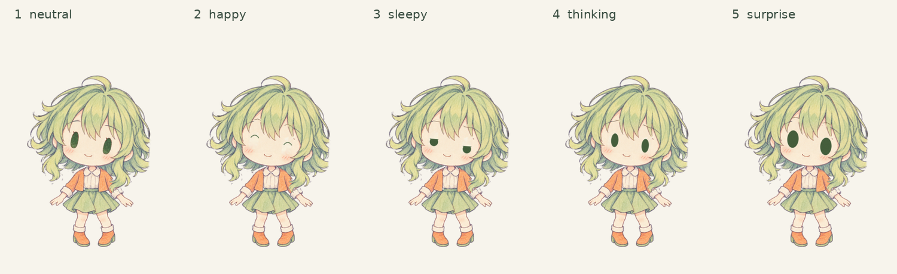

# GUMI Chibi Model for Halfne Miku Studio Reborn

大脸、小身体、铅笔线稿的 GUMI Q 版模型，适用于「小初音工作室 Reborn」。当前发布版本：**v1.0.0**。



## 快速使用

1. 打开 [小初音工作室 Reborn](https://github.com/yuyuyzl/halfne-miku-studio-reborn) 对应的应用。
2. 在 **Settings / 设置** 页选择文件夹图标「导入模型」，导入 `model/GUMI-Chibi-HMSR.js`。
3. PNG 纹理已经嵌入 JS，无需逐张导入。模型开始缓慢摆头、点头和自动眨眼。
4. 要查看五种表情和口型，在 **Timeline / 时间轴** 页导入 `examples/demo-controls-30s.json` 并播放。这个演示为 30 秒、60 fps，不需要音乐。
5. 要手动控制，先暂停时间轴回放，再按下表情或口型键。按住口型键会张嘴，松开恢复闭口。

## 控制

| 键位 | 效果 |
| --- | --- |
| `1` | 普通 / neutral |
| `2` | 开心 / happy |
| `3` | 困倦 / sleepy |
| `4` | 思考 / thinking |
| `5` | 惊讶 / surprise |
| `X` | 按住闭眼 |
| `A` | 大开口 |
| `D` | 中开口 |
| `W` | 圆口 |
| `S` | 小开口 |
| `E` | 大圆口 |

键位可在工作室中重新映射。手动表情按住生效，松开回到普通表情；演示回放中的录制控制会覆盖手动输入。模型仅在读取到新的实时控制时间戳时释放上一段录制的口型和表情。

模型具有 13 个原生节点、26 张唯一内嵌 PNG、五种表情与开眼/闭眼变体、六种口型。头部局部角度约为 **−9.9° 至 +9.78°**，使用平滑的慢摆与轻微点头；颈部固定，后发随头运动。脸部使用刚性分层，不使用网格扭曲。

## 口型与自制动作

模型本身**不会读取音乐并自动生成精确口型**。导入音乐后，可在工作室中录制口型键，或导入自己制作的控制时间轴。这里的无歌演示用按键及少量 `mouthOpen` 控制展示嘴型，不对应任何歌词，也不是音素对齐。

自制时间轴的结构为 `[{"a": [], "v": true, "l": false}]`。每个动作记录为 `{ "t": 毫秒时间, "c": 控制对象 }`；模型可接收 `animationTime`（秒）、`mouthOpen`（0–1）、`expression`（0–4）等字段。请参考随包演示与[上游模型规范](https://github.com/yuyuyzl/halfne-miku-studio-reborn/blob/master/model-docs.md)。内置慢摆和眨眼循环沿用经过验证的模型，约 234 秒一个周期；演示动作不包含歌曲录制数据。

## 从源码构建

构建只需 **Python 3.9+**，无第三方 Python 依赖。

```sh
python scripts/build.py
python scripts/build.py --verify
node --check model/GUMI-Chibi-HMSR.js
```

`source/assets/` 保存 26 张去重 PNG，`source/model-config.json` 保存纹理映射，`source/runtime.js` 保存模型脚本模板。构建脚本会重新嵌入资源，默认输出可直接导入的单文件 JS。`--verify` 检查其是否与 v1.0.0 发布模型字节一致；修改模型后请更新版本及参考校验值。

## 发行与来源

下载者使用 `gumi-chibi-hmsr-v1.0.0-model-release.zip`；需要继续维护源码时使用 `gumi-chibi-hmsr-v1.0.0-github-source.zip`。两者均不包含歌曲、广播剧音频、歌词字幕、演唱口型录制或制作视频。

发布整理：**孤洋鹅_**。GUMI 角色相关权利属于 **INTERNET Co., Ltd.**。角色图像为本次制作生成的素材，表情、嘴型及分层细节由程序处理。该模型为非官方作品。

许可范围和第三方来源见 [LICENSE_NOTICE.md](LICENSE_NOTICE.md) 与 [CREDITS.md](CREDITS.md)。本发布包未为角色图像、上游资料或所有内容统一授予开源许可。源码可见与获得自由使用、商用或再次分发授权是不同事项。

## English overview

A soft pencil-style chibi GUMI model for Halfne Miku Studio Reborn. Import `model/GUMI-Chibi-HMSR.js` in Settings; the 26 PNG resources are embedded. It has five expressions, six mouth shapes, gentle head motion and native blinking. Import the synthetic 30-second Timeline demo to preview controls. Music is not analyzed by this model: use key controls or your own recorded Timeline for lipsync. Build with Python 3; see the notices for rights and third-party attribution.
